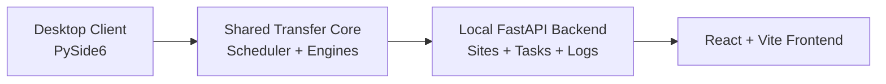
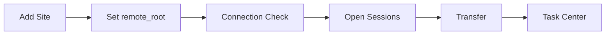

# SSHFerry

<div align="center">
  <p>
    
    
    
    
  </p>

  <h3>Local-first SSH file operations with multi-session transfer control, safer remote boundaries, and inspectable task workflows.</h3>

  <p>
    SSHFerry brings desktop file browsing, transfer scheduling, local backend APIs, and a web UI into one repository for practical day-to-day remote work.
  </p>

  <p>
    <a href="README_zh.md">中文</a> |
    <b>English</b>
  </p>

  <p>
    <a href="#overview">Overview</a> |
    <a href="#why-it-stands-out">Why It Stands Out</a> |
    <a href="#workflow">Workflow</a> |
    <a href="#quick-start">Quick Start</a> |
    <a href="#what-you-get">What You Get</a> |
    <a href="#documentation">Documentation</a>
  </p>
</div>

## Overview

`SSHFerry` is an SSH file operations workspace that combines:

- a Python + PySide6 desktop client for day-to-day use
- a local FastAPI backend for sites, sessions, tasks, logs, and workspace APIs
- a React + Vite frontend that is being integrated around the backend surface

The desktop client is the recommended entry point today. It already covers the main workflow for practical remote file work: local and remote browsing, upload, download, remote-to-remote copy, task control, and safer operation boundaries through `remote_root`.

### Architecture Snapshot



The product stays desktop-first, while the backend and web layers build on the same scheduler and transfer logic instead of reimplementing the stack.

## Why It Stands Out

SSHFerry is built for the gap between raw terminal usage and heavyweight remote file tooling. It keeps common SSH file operations in one place without pretending the workflow is simpler than it is.

| Typical SSH file workflow | SSHFerry |
|---|---|
| Terminal commands, ad hoc scripts, and GUI tools split across tasks | One workspace for browsing, transfer, retry, and task observation |
| Remote copies often need manual coordination | Supports local-to-remote, remote-to-local, and remote-to-remote flows |
| Transfer state is easy to lose once a command starts | Exposes task progress and pause, resume, cancel, and restart controls |
| Dangerous remote paths are easy to touch by mistake | Restricts remote operations with `remote_root` |
| Site setup is repetitive and error-prone | Supports manual setup plus SSH-style command import |

### Current Product Shape

<table>
  <tr>
    <td width="33%" valign="top">
      <h3>🖥️ Desktop First</h3>
      <p>The desktop client is usable today and remains the main product entry for routine file operations.</p>
    </td>
    <td width="33%" valign="top">
      <h3>🧩 Shared Transfer Core</h3>
      <p>The backend reuses the same scheduler and transfer logic instead of forking a second implementation.</p>
    </td>
    <td width="33%" valign="top">
      <h3>🌐 Web In Progress</h3>
      <p>The web frontend already exists in-repo, with backend integration underway rather than being treated as a mock-only shell.</p>
    </td>
  </tr>
</table>

## Workflow

SSHFerry is organized around an inspectable remote-file workflow instead of isolated transfer commands:

1. Add a site manually or import it from an SSH-style command
2. Set `remote_root` to a dedicated directory when possible
3. Run the built-in connection check
4. Open one or more remote sessions
5. Browse local and remote panels side by side
6. Transfer between panels or drag between remote sessions
7. Monitor and control work in the task center

Operational notes:

- Site-level protocol defaults support `sftp` and `scp`
- A window-level override can force `Auto`, `SFTP`, or `SCP`
- If `remote_root` is empty, operations fall back to `/`

### Workflow Diagram



## Quick Start

### Requirements

- Python `3.11+`
- Node.js `18+` for frontend work
- Windows, Linux, or macOS for desktop development

### Install

```bash
pip install -r requirements.txt
```

Frontend dependencies:

```bash
cd frontend
npm install
```

### Recommended Run Path: Desktop Client

Windows:

```powershell
./run.bat
```

Linux or macOS:

```bash
./run.sh
```

Direct module entry:

```bash
python -m src.app.main
```

### Alternative Run Paths

Backend service:

```bash
python -m backend.app.main
```

Frontend app:

```bash
cd frontend
npm run dev
```

Frontend production build:

```bash
cd frontend
npm run build
```

Common backend environment variables:

- `SSHFERRY_BACKEND_HOST` default: `127.0.0.1`
- `SSHFERRY_BACKEND_PORT` default: `18080`
- `SSHFERRY_ALLOWED_ORIGINS`
- `SSHFERRY_LOCAL_TOKEN`

## What You Get

<table>
  <tr>
    <td width="50%" valign="top">
      <h3>Transfer Workspace</h3>
      <ul>
        <li>Manage multiple remote sites in one place</li>
        <li>Browse local and remote files side by side</li>
        <li>Upload, download, and copy across remote sessions</li>
        <li>Choose `sftp`, `scp`, or parallel transfer paths when appropriate</li>
      </ul>
    </td>
    <td width="50%" valign="top">
      <h3>Operational Control</h3>
      <ul>
        <li>Inspect task state instead of relying on terminal output alone</li>
        <li>Pause, resume, cancel, restart, and monitor transfer tasks</li>
        <li>Constrain remote operations with `remote_root`</li>
        <li>Import site information from SSH-style commands</li>
      </ul>
    </td>
  </tr>
</table>

## Testing

Run the full backend-focused test suite:

```bash
pytest
```

The current `pytest` configuration enforces backend coverage reporting and a `99` coverage threshold.

Quick import smoke check:

```bash
python -c "from src.shared.models import SiteConfig, Task; from src.core.scheduler import TaskScheduler; from src.services.connection_checker import ConnectionChecker; print('imports_ok')"
```

## Packaging

Windows packaging currently targets the desktop client.

Standard build:

```powershell
powershell -ExecutionPolicy Bypass -File .\tools\build_windows.ps1 -VenvPath .venv_compat
```

Debug build:

```powershell
powershell -ExecutionPolicy Bypass -File .\tools\build_windows.ps1 -Clean -Debug -VenvPath .venv_compat
```

Release build:

```powershell
powershell -ExecutionPolicy Bypass -File .\tools\build_windows.ps1 -Clean -VenvPath .venv_compat
```

Expected outputs:

```text
release/SSHFerry-<version>-windows/
release/SSHFerry-<version>-windows.zip
release/SSHFerry-<version>-windows.sha256
```

<details>
<summary><b>Repository Layout</b></summary>

```text
src/        Desktop application, transfer engines, scheduler, shared models
backend/    FastAPI backend service
frontend/   React + Vite frontend application
docs/       Maintained implementation and design documents
tests/      Pytest suite
tools/      Packaging and benchmark scripts
```

</details>

## Documentation

- [Docs Index](docs/README.md)
- [Chinese Docs Index](docs/README_zh.md)
- [Backend Overview](docs/backend/BACKEND_OVERVIEW.md)
- [Frontend Build Guide](docs/frontend/FRONTEND_BUILD.md)
- [Frontend API Guide](docs/frontend/FRONTEND_API.md)
- [Frontend Design Guide](docs/frontend/FRONTEND_DESIGN.md)
