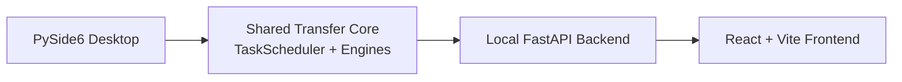

# SSHFerry

<div align="center">
  <p>
    
    
    
    
  </p>

  <h3>A local-first SSH file workspace for sites, sessions, transfer tasks, and safer remote boundaries.</h3>

  <p>
    <a href="README_zh.md">中文</a> |
    <b>English</b>
  </p>

  <p>
    <a href="#highlights">Highlights</a> |
    <a href="#quick-start">Quick Start</a> |
    <a href="#development-and-testing">Development and Testing</a> |
    <a href="#documentation">Documentation</a>
  </p>
</div>

<p align="center">
  
</p>

## Highlights

`SSHFerry` is built for day-to-day SSH file operations: when terminal commands are too scattered and traditional remote file tools feel too heavy, it gives you a focused local workspace with visible transfer state.

- **Desktop first**: a Python + PySide6 client is the recommended entry point today.
- **Multi-session transfers**: move files local-to-remote, remote-to-local, and remote-to-remote.
- **Inspectable tasks**: track progress, speed, and status; pause, resume, cancel, and retry work.
- **Flexible transfer paths**: use `sftp`, `scp`, parallel SFTP, and large-file remote-copy strategies.
- **Safer remote scope**: constrain remote operations with `remote_root` to reduce accidental changes.
- **Web layer in progress**: the FastAPI backend and React + Vite frontend reuse the same transfer core.

## Architecture



```text
src/        Desktop app, transfer engines, scheduler, shared models
backend/    FastAPI backend service
frontend/   React + Vite frontend application
tests/      Pytest suite
tools/      Packaging and benchmark scripts
```

## Quick Start

### Requirements

- Python `3.11+`
- Node.js `18+` for frontend development
- Windows, Linux, or macOS

### Install dependencies

```bash
pip install -r requirements.txt
```

For frontend development:

```bash
cd frontend
npm install
```

### Start the desktop client

Windows:

```powershell
./run.bat
```

Linux / macOS:

```bash
./run.sh
```

Or run the module entry directly:

```bash
python -m src.app.main
```

### Start the backend and frontend

```bash
python -m backend.app.main
```

```bash
cd frontend
npm run dev
```

Common backend environment variables:

- `SSHFERRY_BACKEND_HOST`: default `127.0.0.1`
- `SSHFERRY_BACKEND_PORT`: default `18080`
- `SSHFERRY_ALLOWED_ORIGINS`
- `SSHFERRY_LOCAL_TOKEN`

## Development and Testing

Run tests:

```bash
pytest
```

Quick import smoke check:

```bash
python -c "from src.shared.models import SiteConfig, Task; from src.core.scheduler import TaskScheduler; from src.services.connection_checker import ConnectionChecker; print('imports_ok')"
```

Frontend production build:

```bash
cd frontend
npm run build
```

Windows desktop packaging:

```powershell
powershell -ExecutionPolicy Bypass -File .\tools\build_windows.ps1 -Clean -VenvPath .venv_compat
```

Expected outputs:

```text
release/SSHFerry-<version>-windows/
release/SSHFerry-<version>-windows/SSHFerry.exe
release/SSHFerry-<version>-windows.zip
release/SSHFerry-<version>-windows.sha256
```

## Documentation

- [Docs Index](docs/README.md)
- [中文文档索引](docs/README_zh.md)
- [Backend Overview](docs/backend/BACKEND_OVERVIEW.md)
- [Frontend Build Guide](docs/frontend/FRONTEND_BUILD.md)
- [Frontend API Guide](docs/frontend/FRONTEND_API.md)
- [Frontend Design Guide](docs/frontend/FRONTEND_DESIGN.md)
