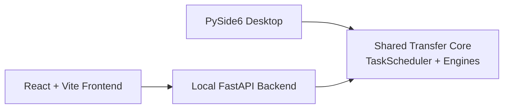

# SSHFerry

<div align="center">
  <p>
    
    
    
    
  </p>

  <h3>A local-first SSH file workspace for sites, sessions, transfer tasks, and safer remote boundaries.</h3>

  <p>
    <a href="README_zh.md">中文</a> |
    <b>English</b>
  </p>

  <p>
    <a href="#highlights">Highlights</a> |
    <a href="#quick-start">Quick Start</a> |
    <a href="#transfer-strategies">Transfer Strategies</a> |
    <a href="#performance-tuning">Performance Tuning</a> |
    <a href="#development-and-testing">Development and Testing</a> |
    <a href="#documentation">Documentation</a>
  </p>
</div>

<p align="center">
  
</p>

## Highlights

`SSHFerry` is built for day-to-day SSH file operations: when terminal commands are too scattered and traditional remote file tools feel too heavy, it gives you a focused local workspace with visible transfer state.

- **Desktop first**: a Python + PySide6 client is the recommended entry point today.
- **Multi-session transfers**: move files local-to-remote, remote-to-local, and remote-to-remote.
- **A transfer core built for speed**: fully pipelined SFTP reads (`readv` batch prefetch), a 16MB channel window, SSH connections reused across files, parallel chunking for large files, and small files bundled into a single tar transfer — far ahead of request-per-round-trip SFTP clients on high-latency links.
- **Inspectable tasks**: track progress, speed, and status; pause, resume, cancel, retry, and resume interrupted transfers from where they stopped.
- **Host key verification (TOFU)**: the server's key fingerprint is recorded on first connect and any later change is rejected with a warning, guarding against man-in-the-middle attacks; interoperates with the system `~/.ssh/known_hosts`.
- **Flexible authentication**: password, key file, ssh-agent, default `~/.ssh` keys, and reaching internal hosts through a jump host (ProxyJump).
- **Safer remote scope**: constrain remote operations with `remote_root` to reduce accidental changes; destructive actions such as recursive deletes ask for confirmation.
- **Web layer in progress**: the FastAPI backend and React + Vite frontend reuse the same transfer core.

## Architecture



```text
src/        Desktop app, transfer engines, scheduler, shared models
backend/    FastAPI backend service
frontend/   React + Vite frontend application
tests/      Pytest suite
tools/      Packaging and benchmark scripts
```

## Transfer Strategies

The scheduler picks a transfer path automatically based on what is being moved:

| Scenario | Automatic strategy |
| --- | --- |
| Regular file | Single-connection SFTP with `readv`-pipelined reads and pipelined writes |
| Large file (default ≥ 50MB) | Parallel SFTP: concurrent chunk transfer over multiple connections |
| Folder with many small files | Bundle into a tar locally → one transfer → unpack remotely (requires remote `tar`; falls back to per-file automatically) |
| Remote ↔ remote | Relayed streaming copy; very large files race a "direct + relay" dual-path pipeline |
| Interrupted transfer / retry | Resumes from completed bytes; files that already exist with matching size are skipped |

Thresholds and details for each strategy are described in the [transfer rules notes](docs/backend/TRANSFER_RULES_zh.md) (Chinese).

## Quick Start

### Requirements

- Python `3.11+`
- Node.js `18+` for frontend development
- Windows, Linux, or macOS

### Install dependencies

```bash
pip install -r requirements.txt
```

For frontend development:

```bash
cd frontend
npm install
```

### Start the desktop client

Windows:

```powershell
./run.bat
```

Linux / macOS:

```bash
./run.sh
```

Or run the module entry directly:

```bash
python -m src.app.main
```

### Start the backend and frontend

```bash
python -m backend.app.main
```

```bash
cd frontend
npm run dev
```

Default addresses: backend at `http://127.0.0.1:18080`, frontend dev server at `http://127.0.0.1:5173`. On first use of the web UI, create a local account on the login page.

Common backend environment variables:

- `SSHFERRY_BACKEND_HOST`: default `127.0.0.1`
- `SSHFERRY_BACKEND_PORT`: default `18080`
- `SSHFERRY_ALLOWED_ORIGINS`
- `SSHFERRY_LOCAL_TOKEN`

## Performance Tuning

The defaults suit most setups; these environment variables are the most useful performance knobs:

| Variable | Default | Description |
| --- | --- | --- |
| `SSHFERRY_SFTP_WINDOW_BYTES` | `16MB` | SSH channel receive window. Single-connection throughput on a high-latency link tops out around window ÷ RTT — raise this first when bandwidth is left on the table |
| `SSHFERRY_PARALLEL_THRESHOLD_BYTES` | `50MB` | Files larger than this use parallel chunked transfer |
| `SSHFERRY_PARALLEL_PRESET` | upload `medium` / download `high` | Parallelism tier: `low` (4 connections) / `medium` (10) / `high` (16); override per direction with `SSHFERRY_PARALLEL_UPLOAD_PRESET` / `..._DOWNLOAD_PRESET` |
| `SSHFERRY_FOLDER_ARCHIVE_ENABLED` | `1` | Toggle for tar-bundled small-file transfers |
| `SSHFERRY_SCP_BUFF_BYTES` | `1MB` | SCP engine transfer buffer |
| `SSHFERRY_STRICT_HOSTKEY` | off | When set, reject hosts not already in known_hosts (by default new hosts are recorded on first use and only *changed* keys are rejected) |

The full list (chunk sizes, retry counts, dual-path thresholds, and more) lives in the [transfer rules notes](docs/backend/TRANSFER_RULES_zh.md) (Chinese). The bundled benchmark script compares configurations:

```bash
python tools/benchmark_transfer.py --site my-server --size-mb 512 --modes sftp,parallel:high
```

## Development and Testing

Run the tests (includes the backend coverage gate; everything should pass):

```bash
pytest
```

Quick import smoke check:

```bash
python -c "from src.shared.models import SiteConfig, Task; from src.core.scheduler import TaskScheduler; from src.services.connection_checker import ConnectionChecker; print('imports_ok')"
```

Frontend production build:

```bash
cd frontend
npm run build
```

Windows desktop packaging:

```powershell
powershell -ExecutionPolicy Bypass -File .\tools\build_windows.ps1 -Clean -VenvPath .venv_compat
```

Expected outputs:

```text
release/SSHFerry-<version>-windows/
release/SSHFerry-<version>-windows/SSHFerry.exe
release/SSHFerry-<version>-windows.zip
release/SSHFerry-<version>-windows.sha256
```

## Documentation

- [Docs Index](docs/README.md)
- [中文文档索引](docs/README_zh.md)
- [Backend Overview](docs/backend/BACKEND_OVERVIEW.md)
- [Transfer Rules Notes (Chinese)](docs/backend/TRANSFER_RULES_zh.md)
- [Frontend Build Guide](docs/frontend/FRONTEND_BUILD.md)
- [Frontend API Guide](docs/frontend/FRONTEND_API.md)
- [Frontend Design Guide](docs/frontend/FRONTEND_DESIGN.md)
