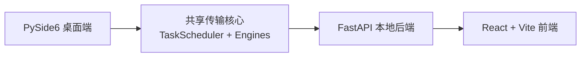

# SSHFerry

<div align="center">
  <p>
    
    
    
    
  </p>

  <h3>本地优先的 SSH 文件工作区：集中管理站点、会话、传输任务和远端操作边界。</h3>

  <p>
    <b>中文</b> |
    <a href="README.md">English</a>
  </p>

  <p>
    <a href="#亮点">亮点</a> |
    <a href="#快速开始">快速开始</a> |
    <a href="#开发与测试">开发与测试</a> |
    <a href="#文档">文档</a>
  </p>
</div>

<p align="center">
  
</p>

## 亮点

`SSHFerry` 面向日常 SSH 文件操作：当终端命令太分散、传统远程文件工具又太重时，它提供一个更集中、更可观察的本地工作区。

- **桌面端优先**：基于 Python + PySide6，当前推荐作为主入口使用。
- **多会话传输**：支持本地到远端、远端到本地、远端到远端复制。
- **任务可观察**：查看进度、速度、状态，并支持暂停、继续、取消和重试。
- **传输策略可选**：支持 `sftp`、`scp`、并行 SFTP，以及大文件远端互传路径。
- **远端边界保护**：通过 `remote_root` 收窄远端文件操作范围，降低误操作风险。
- **Web 层持续集成**：FastAPI 后端和 React + Vite 前端复用同一套传输核心。

## 架构



```text
src/        桌面应用、传输引擎、调度器、共享模型
backend/    FastAPI 后端服务
frontend/   React + Vite 前端应用
tests/      Pytest 测试集
tools/      打包与基准测试脚本
```

## 快速开始

### 环境要求

- Python `3.11+`
- Node.js `18+`（仅前端开发需要）
- Windows、Linux 或 macOS

### 安装依赖

```bash
pip install -r requirements.txt
```

如需开发前端：

```bash
cd frontend
npm install
```

### 启动桌面端

Windows：

```powershell
./run.bat
```

Linux / macOS：

```bash
./run.sh
```

或直接运行模块入口：

```bash
python -m src.app.main
```

### 启动后端与前端

```bash
python -m backend.app.main
```

```bash
cd frontend
npm run dev
```

常用后端环境变量：

- `SSHFERRY_BACKEND_HOST`：默认 `127.0.0.1`
- `SSHFERRY_BACKEND_PORT`：默认 `18080`
- `SSHFERRY_ALLOWED_ORIGINS`
- `SSHFERRY_LOCAL_TOKEN`

## 开发与测试

运行测试：

```bash
pytest
```

快速导入自检：

```bash
python -c "from src.shared.models import SiteConfig, Task; from src.core.scheduler import TaskScheduler; from src.services.connection_checker import ConnectionChecker; print('imports_ok')"
```

前端生产构建：

```bash
cd frontend
npm run build
```

Windows 桌面端打包：

```powershell
powershell -ExecutionPolicy Bypass -File ./tools/build_windows.ps1 -Clean -VenvPath .venv_compat
```

预期输出：

```text
release/SSHFerry-<version>-windows/
release/SSHFerry-<version>-windows/SSHFerry.exe
release/SSHFerry-<version>-windows.zip
release/SSHFerry-<version>-windows.sha256
```

## 文档

- [文档索引](docs/README_zh.md)
- [English Docs Index](docs/README.md)
- [后端总览](docs/backend/BACKEND_OVERVIEW_zh.md)
- [前端构建指南](docs/frontend/FRONTEND_BUILD_zh.md)
- [前端接口指南](docs/frontend/FRONTEND_API_zh.md)
- [前端设计指南](docs/frontend/FRONTEND_DESIGN_zh.md)
