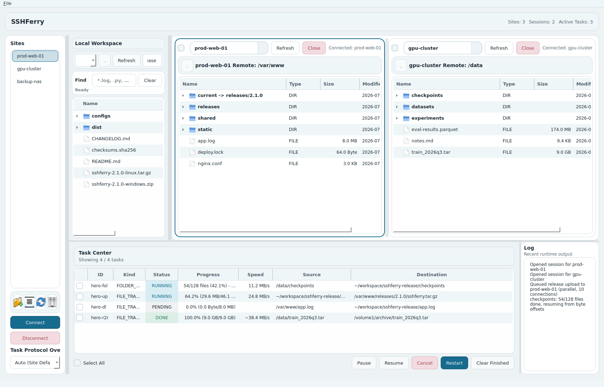
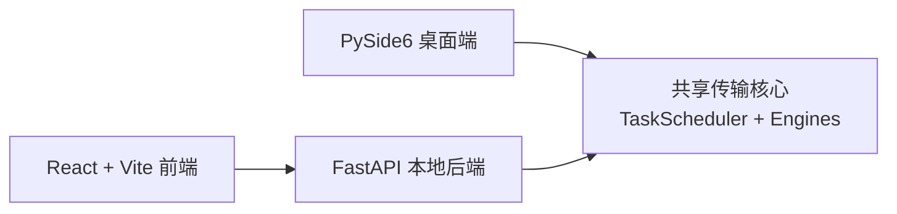

# SSHFerry

<div align="center">
  <p>
    
    
    
    
  </p>

  <h3>本地优先的 SSH 文件工作区：集中管理站点、会话、传输任务和远端操作边界。</h3>

  <p>
    <b>中文</b> |
    <a href="README.md">English</a>
  </p>

  <p>
    <a href="#亮点">亮点</a> |
    <a href="#快速开始">快速开始</a> |
    <a href="#传输策略">传输策略</a> |
    <a href="#性能调优">性能调优</a> |
    <a href="#开发与测试">开发与测试</a> |
    <a href="#文档">文档</a>
  </p>
</div>

<p align="center">
  
</p>

## 亮点

`SSHFerry` 面向日常 SSH 文件操作：当终端命令太分散、传统远程文件工具又太重时，它提供一个更集中、更可观察的本地工作区。

- **桌面端优先**：基于 Python + PySide6，当前推荐作为主入口使用；界面默认中文，可在"语言"菜单或用 `SSHFERRY_LANG=en` 切换英文。
- **多会话传输**：支持本地到远端、远端到本地、远端到远端复制。
- **为速度而生的传输核心**：SFTP 读取全程流水线化（`readv` 批量预取）、16MB 通道窗口、跨文件复用 SSH 连接、大文件并行分块、小文件自动打包成 tar 一次传输——高延迟链路上的表现远超逐请求往返的普通 SFTP 客户端。
- **任务可观察**：查看进度、速度、状态，并支持暂停、继续、取消、重试和断点续传。
- **主机密钥校验（TOFU）**：首次连接记录服务器密钥指纹，之后密钥变更会被拒绝并告警，防范中间人攻击；兼容系统 `~/.ssh/known_hosts`。
- **灵活的认证方式**：密码、密钥文件、ssh-agent、默认 `~/.ssh` 密钥，以及通过跳板机（ProxyJump）连接内网主机。
- **远端边界保护**：通过 `remote_root` 收窄远端文件操作范围，降低误操作风险；递归删除等危险操作需要确认。
- **Web 层持续集成**：FastAPI 后端和 React + Vite 前端复用同一套传输核心。

## 架构



```text
src/        桌面应用、传输引擎、调度器、共享模型
backend/    FastAPI 后端服务
frontend/   React + Vite 前端应用
tests/      Pytest 测试集
tools/      打包与基准测试脚本
```

## 传输策略

调度器会按文件形态自动选择传输路径，无需手动干预：

| 场景 | 自动策略 |
| --- | --- |
| 普通文件 | 单连接 SFTP，`readv` 流水线读取 + 管道化写入 |
| 大文件（默认 ≥ 50MB） | 并行 SFTP：多连接分块并发传输 |
| 文件夹内大量小文件 | 本地打包为 tar → 单次传输 → 远端解包（需远端有 `tar`，不可用时自动回退逐文件） |
| 远端 ↔ 远端 | 中继流式复制；超大文件走"直连 + 中继"双路通道竞速 |
| 传输中断 / 重试 | 按已完成字节断点续传，已存在且大小一致的文件自动跳过 |

各策略的阈值和细节见[传输规则说明](docs/backend/TRANSFER_RULES_zh.md)。

## 快速开始

### 环境要求

- Python `3.11+`
- Node.js `18+`（仅前端开发需要）
- Windows、Linux 或 macOS

### 安装依赖

```bash
pip install -r requirements.txt
```

如需开发前端：

```bash
cd frontend
npm install
```

### 启动桌面端

Windows：

```powershell
./run.bat
```

Linux / macOS：

```bash
./run.sh
```

或直接运行模块入口：

```bash
python -m src.app.main
```

### 启动后端与前端

```bash
python -m backend.app.main
```

```bash
cd frontend
npm run dev
```

默认地址：后端 `http://127.0.0.1:18080`，前端开发服务器 `http://127.0.0.1:5173`。Web 端首次使用需在登录页注册一个本地账号。

常用后端环境变量：

- `SSHFERRY_BACKEND_HOST`：默认 `127.0.0.1`
- `SSHFERRY_BACKEND_PORT`：默认 `18080`
- `SSHFERRY_ALLOWED_ORIGINS`
- `SSHFERRY_LOCAL_TOKEN`

## 性能调优

默认配置面向大多数场景，以下环境变量是最常用的"性能旋钮"：

| 变量 | 默认值 | 说明 |
| --- | --- | --- |
| `SSHFERRY_SFTP_WINDOW_BYTES` | `16MB` | SSH 通道接收窗口。高延迟链路的单连接吞吐上限约为 窗口 ÷ RTT，带宽跑不满时优先调大它 |
| `SSHFERRY_PARALLEL_THRESHOLD_BYTES` | `50MB` | 超过该大小的文件启用并行分块传输 |
| `SSHFERRY_PARALLEL_PRESET` | 上传 `medium` / 下载 `high` | 并行档位：`low`(4 连接) / `medium`(10) / `high`(16)，可用 `SSHFERRY_PARALLEL_UPLOAD_PRESET` / `..._DOWNLOAD_PRESET` 分方向覆盖 |
| `SSHFERRY_FOLDER_ARCHIVE_ENABLED` | `1` | 小文件 tar 打包传输开关 |
| `SSHFERRY_SCP_BUFF_BYTES` | `1MB` | SCP 引擎传输缓冲区 |
| `SSHFERRY_STRICT_HOSTKEY` | 关闭 | 开启后拒绝不在 known_hosts 中的主机（默认首次连接自动记录，仅当密钥*变更*时才拒绝） |

完整清单（分块大小、重试次数、双路通道阈值等）见[传输规则说明](docs/backend/TRANSFER_RULES_zh.md)。也可以用自带的基准脚本对比不同配置：

```bash
python tools/benchmark_transfer.py --site my-server --size-mb 512 --modes sftp,parallel:high
```

## 开发与测试

运行测试（含后端覆盖率门槛，应全部通过）：

```bash
pytest
```

快速导入自检：

```bash
python -c "from src.shared.models import SiteConfig, Task; from src.core.scheduler import TaskScheduler; from src.services.connection_checker import ConnectionChecker; print('imports_ok')"
```

前端生产构建：

```bash
cd frontend
npm run build
```

Windows 桌面端打包：

```powershell
powershell -ExecutionPolicy Bypass -File ./tools/build_windows.ps1 -Clean -VenvPath .venv_compat
```

预期输出：

```text
release/SSHFerry-<version>-windows/
release/SSHFerry-<version>-windows/SSHFerry.exe
release/SSHFerry-<version>-windows.zip
release/SSHFerry-<version>-windows.sha256
```

## 文档

- [文档索引](docs/README_zh.md)
- [English Docs Index](docs/README.md)
- [后端总览](docs/backend/BACKEND_OVERVIEW_zh.md)
- [传输规则说明](docs/backend/TRANSFER_RULES_zh.md)
- [前端构建指南](docs/frontend/FRONTEND_BUILD_zh.md)
- [前端接口指南](docs/frontend/FRONTEND_API_zh.md)
- [前端设计指南](docs/frontend/FRONTEND_DESIGN_zh.md)
